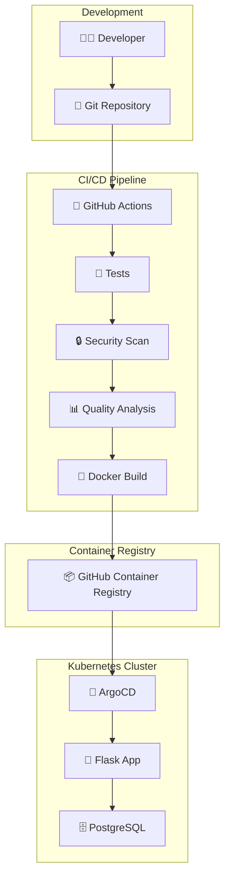

# GitHub Actions + Argo CD | Laboratorio práctico

[](https://github.com/EvaristoGZ/GitHubActions-ArgoCD-lab/actions)
[](https://sonarcloud.io/dashboard?id=EvaristoGZ_GitHubActions-ArgoCD-lab)
[](https://sonarcloud.io/dashboard?id=EvaristoGZ_GitHubActions-ArgoCD-lab)

Resultado de la Práctica Final del módulo "Ciclo de vida de un desarrollo: CI/CD" de la XII Edición Bootcamp DevOps & Cloud Computing Full Stack de KeepCoding.

Se trata de una práctica con unos hitos marcados que tienen como objetivo aprender a implementar un pipeline CI/CD con GitHub Actions para una aplicación Python Flask, incluyendo análisis de seguridad, calidad de código y despliegue automatizado con ArgoCD en un clúster local de Kubernetes con Kind.

El resultado final contempla un laboratorio con una arquitectura ficticia y simplificada, pero funcional, donde se implementan prácticas de DevOps modernas: desde el desarrollo colaborativo con GitFlow, pasando por un pipeline de CI/CD, hasta el despliegue automatizado siguiendo principios GitOps.

[](https://www.linkedin.com/in/evaristogz/)

---

[🔽 Ir directamente a 🚀 Cómo desplegar GitHubActions-ArgoCD-lab 🔽](#-c%C3%B3mo-desplegar-githubactions-argocd-lab)

## 📋 Índice de contenidos

- [🎯 Descripción del proyecto](#-descripción-del-proyecto)
- [🛠️ Stack tecnológico](#️-stack-tecnológico)
- [🏗️ Diagrama de arquitectura](#️-diagrama-de-arquitectura)
- [🔄 Pipeline CI/CD](#-pipeline-cicd)
- [📦 Estructura del repositorio](#-estructura-del-repositorio)
- [🚀 Cómo desplegar GitHubActions-ArgoCD-lab](#-c%C3%B3mo-desplegar-githubactions-argocd-lab)
- [⚙️ Configuración](#️-configuración)
- [🧪 Testing](#-testing)
- [🔒 Seguridad](#-seguridad)
- [📊 Calidad de código](#-calidad-de-código)
- [🐳 Containerización](#-containerización)
- [☸️ Despliegue en Kubernetes](#️-despliegue-en-kubernetes)
- [📈 Monitoreo y observabilidad](#-monitoreo-y-observabilidad)

## 🎯 Descripción del proyecto

**kc-visit-counter** es una aplicación web desarrollada en Python Flask que registra y muestra las diez últimas visitas utilizando una base de datos PostgreSQL. El proyecto implementa un pipeline CI/CD completo siguiendo las prácticas de DevOps como GitFlow y GitOps.

### Características principales

- **Aplicación Flask** con interfaz web simple.
- **Base de datos PostgreSQL** para persistencia.
- **Logging estructurado** en formato JSON.
- **Pipeline CI/CD automatizado** con múltiples quality gates.
- **Análisis de seguridad** integrado con Snyk.
- **Análisis de calidad** con SonarCloud.
- **Despliegue GitOps** con ArgoCD.
- **Containerización** con Docker.
- **Orquestación** con Kubernetes con Kind.

## 🛠️ Stack tecnológico

### Backend e infraestructura


### DevOps y CI/CD


### Calidad y seguridad


### Contenedores y registro


## 🏗️ Diagrama de arquitectura



## 🔄 Pipeline CI/CD

El pipeline está diseñado con **3 jobs secuenciales** que implementan quality gates progresivos:

### 1. 🧪 Tests Job: Calidad de código
```yaml
# Ejecuta en todas las ramas (develop, main)
- ✅ Checkout del código con historial completo
- ✅ Configuración de Python 3.12
- ✅ Instalación de dependencias
- ⚠️ Análisis de código con Black (formato)
- ⚠️ Análisis de código con Ruff (linting)
- ✅ Ejecución de tests con pytest
- ✅ Generación de coverage report
- ✅ Subida de artifacts (coverage.xml)
- ✅ Análisis de calidad con SonarCloud
- ✅ Quality Gate check (necesario Team Plan en SonarCloud)
```

### 2. 🔒 Security Job: Análisis de seguridad
```yaml
# Ejecuta en todas las ramas, después de tests
- ✅ Snyk - Análisis de dependencias
- ✅ Snyk - Análisis de Infrastructure as Code
- ✅ Subida de resultados SARIF a GitHub Security
```

### 3. 🐳 Docker Job: Construye y despliega
```yaml
# Ejecuta solo rama main, después de tests + security
- ✅ Docker build multi-architecture
- ✅ Push a GitHub Container Registry
- ✅ Snyk - Análisis de seguridad del container
- ✅ Trigger de ArgoCD para deployment
```

### 🎯 Quality gates implementados

| Gate | Herramienta | Acción si falla | Rama |
|------|-------------|-----------------|------|
| **Unit Tests** | pytest | ❌ Detiene pipeline | Todas |
| **Code Style** | Black | ⚠️ Warning amarillo | Todas |
| **Linting** | Ruff | ⚠️ Warning amarillo | Todas |
| **Coverage** | pytest-cov + SonarCloud | ⚠️ Reporta en dashboard | Todas |
| **Quality Gate** | SonarCloud | ❌ Detiene pipeline | Todas |
| **Dependencies** | Snyk | ❌ Detiene pipeline | Todas |
| **IaC Security** | Snyk | ❌ Detiene pipeline | Todas |
| **Container Security** | Snyk | ⚠️ Reporta | Solo main |


## 📦 Estructura del repositorio

```
GitHubActions-ArgoCD-lab/
├── 📁 .github/
│   └── 📁 workflows/
│       └── 📄 egz-workflow.yml      <- Pipeline CI/CD principal
├── 📁 app/                          <- Código fuente kc-visit-counter
│   ├── 📄 app.py                    <- Aplicación Flask principal
│   ├── 📄 requirements.txt          <- Dependencias Python
│   ├── 📄 Dockerfile                <- Dockerfile para contenedor Python
│   └── 📁 static                    <- Directorio estáticos app
│       └── 📄 style.css             <- Hoja de estilo aplicada al HTML
├── 📁 deploy/                       <- Manifiestos Kubernetes
│   ├── 📄 namespace.yaml            <- Namespace kc
│   ├── 📄 deployment.yaml           <- Deployment de la app
│   ├── 📄 service.yaml              <- Service ClusterIP
│   ├── 📄 postgres.yaml             <- StatefulSet PostgreSQL
│   ├── 📄 postgres-init.yaml        <- Schema de la base de datos
│   ├── 📄 secrets-db-example.yaml   <- Ejemplo de secrets
│   └── 📄 app-argocd.yaml           <- Aplicación ArgoCD
├── 📁 tests/                        <- Tests de CI/CD
│   ├── 📄 test_import_app.py        <- Test importación
│   ├── 📄 test_smoke.py             <- Tests de integración
│   └── 📄 test_db_ping.py           <- Test conexión DB
├── 📄 kind-cluster.yaml             <- Configuración Kind clúster
└── 📄 sonar-project.properties      <- Configuración SonarCloud
```

## 🚀 Cómo desplegar GitHubActions-ArgoCD-lab

### Requisitos

-  Docker Desktop
-  Kind (Kubernetes in Docker)
-  kubectl
-  ArgoCD
-  Cuenta en SonarCloud
-  Cuenta en Snyk
-  Cuenta en GitHub

Ejecutado en Windows 11 con Docker Desktop 4.48.0, Docker Engine v28.5.1, Kind v0.23.0 y ArgoCD v3.1.9

Para beneficiarse de las ventajas de los servicios de terceros, se recomienda que el repositorio GitHub sea público.

### 1. Clonar el repositorio

```bash
git clone https://github.com/EvaristoGZ/GitHubActions-ArgoCD-lab.git ; cd GitHubActions-ArgoCD-lab
```

### 2. Crear cluster de Kind

```bash
kind create cluster --config kind-cluster.yaml
```

### 3. Conectar aplicaciones

#### 3.1 Conectar Snyk
Visita [Snyk.io](https://snyk.io/), conéctate con tu cuenta de GitHub y extrae un [token personal](https://app.snyk.io/account).

Añade este token como secreto en la configuración de tu repositorio (Settings>Secrets and Variables>Actions>Repository secrets) con el nombre *SNYK_TOKEN*.

#### 3.2 Conectar SonarCloud
Visita [Sonarcloud.io](https://sonarcloud.io/), conéctate con tu cuenta de GitHub, crea un proyecto y extrae un [token personal](https://sonarcloud.io/account/security).

Añade este token como secreto en la configuración de tu repositorio (Settings>Secrets and Variables>Actions>Repository secrets) con el nombre *SONAR_TOKEN*.

### 4. Instalar y desplegar ArgoCD 

#### 4.1 Crear namespace argocd
```kubectl create namespace argocd```

#### 4.2 Instalar ArgoCD
```kubectl apply -n argocd -f https://raw.githubusercontent.com/argoproj/argo-cd/stable/manifests/install.yaml```

#### 4.3 Crear Port-forward en otra terminal
```kubectl port-forward svc/argocd-server -n argocd 9090:443```

#### 4.4 Acceder a la interfaz web de ArgoCD
Acceder a https://localhost:9090 desde un navegador web y aceptar la conexión al sitio no seguro.

#### 4.5 Obtener la contraseña inicial del usuario admin
```kubectl -n argocd get secret argocd-initial-admin-secret -o jsonpath="{.data.password}" | base64 -d; echo```

#### 4.6 Desplegar aplicación desde app-argocd.yaml
```kubectl apply -f deploy/app-argocd.yaml```

### 5. Acceder a kc-visit-counter
Acceder a http://localhost:8080 desde un navegador web.

Nota: las visitas se incrementarán automáticamente cada 90 segundos debido a que la comprobación del deployment se hace a esa dirección URL.

> [!NOTE]
> Si quieres recrear este laboratorio, deberás hacer un fork del repositorio y hacer cambios en las referencias de los ficheros contenidos en la carpeta deploy.

## ⚙️ Configuración

### Variables de entorno requeridas

#### GitHub Secrets
```yaml
SNYK_TOKEN          # Token de autenticación Snyk
SONAR_TOKEN         # Token de SonarCloud
GITHUB_TOKEN        # Token GitHub (automático, no hace falta definirlo)
```

#### Aplicación
Personalizables en *secrets-db-example.yaml*
```yaml
DB_NAME             # Nombre de la base de datos
DB_USER             # Usuario PostgreSQL
DB_PASSWORD         # Contraseña PostgreSQL
DB_HOST             # Host PostgreSQL
DB_PORT             # Puerto PostgreSQL (default: 5432)
```

## 🧪 Testing

### Ejecución local

```bash
# Estando en el repositorio git, crear entorno virtual de Python
python3 -m venv ../venv

# Cargar entorno virtual
source ../venv/bin/activate

# Instalar dependencias de desarrollo
pip install -r app/requirements.txt pytest pytest-cov black ruff

# Ejecutar tests
pytest tests/ --cov=app --cov-report=html --cov-report=term

# Corregir estilo de código
black app tests
ruff check app tests
```

### Suite de tests

| Archivo | Propósito | Cobertura |
|---------|-----------|-----------|
| `test_import_app.py` | Verificar importación correcta | Sintaxis |
| `test_smoke.py` | Tests de integración básicos | Funcionalidad |
| `test_db_ping.py` | Conectividad con PostgreSQL | Base de datos |

### Coverage Report

El pipeline genera reportes de cobertura automáticamente:
- **Consola**: Durante la ejecución de tests
- **Archivo XML**: Para integración con SonarCloud
- **GitHub Actions**: Como artifact descargable

## 🔒 Seguridad

### Análisis automatizado con Snyk

#### 1. Análisis de Dependencias
```yaml
# Escanea requirements.txt en busca de vulnerabilidades
snyk test --file=app/requirements.txt --severity-threshold=medium
```

#### 2. Infrastructure as Code (IaC)
```yaml
# Analiza manifiestos Kubernetes
snyk iac test deploy/ --severity-threshold=high
```

#### 3. Análisis de Containers
```yaml
# Escanea la imagen Docker final
snyk container test ghcr.io/evaristogz/gitdhubactions-argocd-lab/kc-visit-counter:latest
```

### Reportes de Seguridad

- **📊 GitHub Security Tab**: Resultados integrados en formato SARIF
- **🔍 Snyk Dashboard**: Monitoreo continuo y alertas
- **⚠️ Pull Request Checks**: Bloqueo automático si vulnerabilidades críticas

### Mejores prácticas implementadas

- **Secrets management** con Kubernetes Secrets
- **Least privilege** en permisos de GitHub Actions
- **Multi-stage Docker builds** para imágenes mínimas
- **Vulnerability scanning** en múltiples capas
- **SARIF integration** para visibilidad centralizada

## 📊 Calidad de Código

### Métricas SonarCloud

| Métrica | Objetivo | Estado Actual |
|---------|----------|---------------|
| **Coverage** | > 80% | [](https://sonarcloud.io/dashboard?id=EvaristoGZ_GitHubActions-ArgoCD-lab) |
| **Duplicated Lines** | < 3% | [](https://sonarcloud.io/dashboard?id=EvaristoGZ_GitHubActions-ArgoCD-lab) |
| **Maintainability** | A | [](https://sonarcloud.io/dashboard?id=EvaristoGZ_GitHubActions-ArgoCD-lab) |
| **Reliability** | A | [](https://sonarcloud.io/dashboard?id=EvaristoGZ_GitHubActions-ArgoCD-lab) |

### Herramientas de Calidad

#### **Black - Code Formatting**
```bash
# Formateo automático
black app tests

# Verificación (usado en CI)
black --check app tests
```

#### **Ruff - Linting Ultra-Rápido**
```bash
# Análisis completo
ruff check app tests

# Auto-fix (cuando sea posible)
ruff check app tests --fix
```

#### SonarCloud - Análisis estático
- **Bugs**: Detección de errores potenciales
- **Security Hotspots**: Revisión de código sensible
- **Code Smells**: Mejoras de mantenibilidad
- **Technical Debt**: Estimación de tiempo de mejora

## 🐳 Containerización

### Dockerfile Multi-Stage

```dockerfile
# Build stage optimizado
FROM python:3.12-slim as builder
WORKDIR /app
COPY requirements.txt .
RUN pip install --user --no-cache-dir -r requirements.txt

# Production stage mínimo
FROM python:3.12-slim
WORKDIR /app
COPY --from=builder /root/.local /root/.local
COPY . .
EXPOSE 5000
CMD ["python", "app.py"]
```

### Características de la imagen

- **Multi-stage build** para tamaño optimizado
- **Python slim base** para footprint mínimo
- **User-space installs** para seguridad
- **Vulnerability scanning** automático
- **Multi-architecture** support (amd64, arm64)

### Registry y Tagging

```yaml
# Tags automáticos generados
ghcr.io/evaristogz/githubactions-argocd-lab/kc-visit-counter:latest
ghcr.io/evaristogz/githubactions-argocd-lab/kc-visit-counter:sha-abc1234
```

## ☸️ Despliegue en Kubernetes

### Arquitectura del despliegue

```yaml
# Namespace aislado
apiVersion: v1
kind: Namespace
metadata:
  name: kc

# StatefulSet para PostgreSQL (persistencia)
apiVersion: apps/v1
kind: StatefulSet
metadata:
  name: postgres-statefulset

# Deployment para la aplicación Flask
apiVersion: apps/v1
kind: Deployment
metadata:
  name: kc-visit-counter-deployment
```

### Componentes desplegados

| Componente | Tipo | Propósito |
|-----------|------|-----------|
| **kc-visit-counter** | Deployment | Aplicación web Flask |
| **postgres** | StatefulSet | Base de datos con persistencia |
| **postgres-init** | Job | Inicialización de esquema DB |
| **secrets-db** | Secret | Credenciales de base de datos |
| **kc-visit-counter-service** | Service | Exposición interna ClusterIP |

### GitOps con ArgoCD

#### Aplicación ArgoCD
```yaml
apiVersion: argoproj.io/v1alpha1
kind: Application
metadata:
  name: kc-visit-counter
  namespace: argocd
spec:
  source:
    repoURL: 'https://github.com/EvaristoGZ/GitHubActions-ArgoCD-lab'
    targetRevision: main
    path: deploy
  destination:
    server: 'https://kubernetes.default.svc'
    namespace: kc
  syncPolicy:
    automated:
      prune: true
      selfHeal: true
```

#### Flujo GitOps
1. **📝 Commit** → Push a rama main
2. **🔄 CI/CD** → Pipeline builds nueva imagen
3. **📦 Registry** → Imagen tagged y pushed
4. **🔄 ArgoCD** → Detecta cambios automáticamente
5. **☸️ Deploy** → Sincroniza estado deseado
6. **✅ Health Check** → Verifica despliegue exitoso

## 📈 Monitoreo y observabilidad

### Logging estructurado

```python
# Logging en formato JSON para mejor parseado
import logging
from pythonjsonlogger import jsonlogger

formatter = jsonlogger.JsonFormatter("%(asctime)s %(levelname)s %(message)s")
```

### Health Checks

```yaml
# Kubernetes liveness/readiness probes
livenessProbe:
  httpGet:
    path: /
    port: 5000
  initialDelaySeconds: 30
  periodSeconds: 10
```

### Métricas Disponibles

- **🔍 GitHub Actions**: Métricas de pipeline y deployment
- **📊 SonarCloud**: Métricas de calidad y coverage
- **🔒 Snyk**: Métricas de seguridad y vulnerabilidades
- **☸️ ArgoCD**: Estado de sincronización y health

### Comandos útiles

```bash
# Verificar estado del cluster
kubectl get all -n kc

# Ver logs de la aplicación
kubectl logs -f deployment/kc-visit-counter-deployment -n kc

# Acceder a ArgoCD UI
kubectl port-forward svc/argocd-server -n argocd 8080:443

# Verificar sincronización ArgoCD
argocd app sync kc-visit-counter

# Eliminar clúster y limpiar recursos
kind delete cluster --name local-k8s-cluster
```

---

## 📋 Entregables

| # | Entregable | Enlace/Ubicación |
|---|------------|------------------|
| 1 | **Repositorio GitHub** | [https://github.com/EvaristoGZ/GitHubActions-ArgoCD-lab](https://github.com/EvaristoGZ/GitHubActions-ArgoCD-lab) |
| 2 | **Repositorio de artefactos** | [Ver repositorio](https://github.com/EvaristoGZ?tab=packages&repo_name=GitHubActions-ArgoCD-lab) |
| 3 | **Pipeline CI/CD** | [Ver fichero *egz-workflow.yml*](.github/workflows/egz-workflow.yml) |
| 4 | **Screenshots del pipeline** | [Ver imagen *04-pipeline.jpg*](#) |
| 5 | **Manifiestos de Kubernetes** | [Ver directorio *deploy/*](deploy/) |
| 6 | **Aplicación desplegada** | [Ver imagen *06-kc-visit-counter.jpg*](#) |
| 7 | **Proyecto en ArgoCD** | [Ver imagen *07-argocd.jpg*](#) |
| 8 | **Proyecto en SonarCloud** | [Ver imagen *08-sonarcloud.jpg*](#) |
| 9 | **Proyecto en Snyk** | [Ver imagen *04-pipeline.jpg*](#) |
| 10 | **Vídeo explicativo** | *[Pendiente de subir a YouTube]* |